# 设计模式三大类23种详解

## 0. 原则

- 单一职责原则（Single Responsibility Principle）：一个类或方法应该只负责一项职责。
- 开放封闭原则（Open-Closed Principle）：一个软件实体应该对扩展开放，对修改关闭。
- 里氏替换原则（Liskov Substitution Principle）：所有引用基类的地方都可以替换成子类。
- 接口隔离原则（Interface Segregation Principle）：多个特定的接口比一个通用的接口更好。
- 依赖倒置原则（Dependency Inversion Principle）：高层模块不应该依赖于低层模块，二者都应该依赖于抽象。

## 1. 创建型模式（5种）

提供了一种创建对象的最佳方式。这些模式涉及到如何实例化对象，并且隐藏了实例化的细节，不直接使用new。

### 1.1 工厂方法模式（Factory Method）
**用途**：创建对象时指定精确类型
**关键字**：动态生产对象
**核心思想**：将对象创建委托给子类，通过继承实现扩展
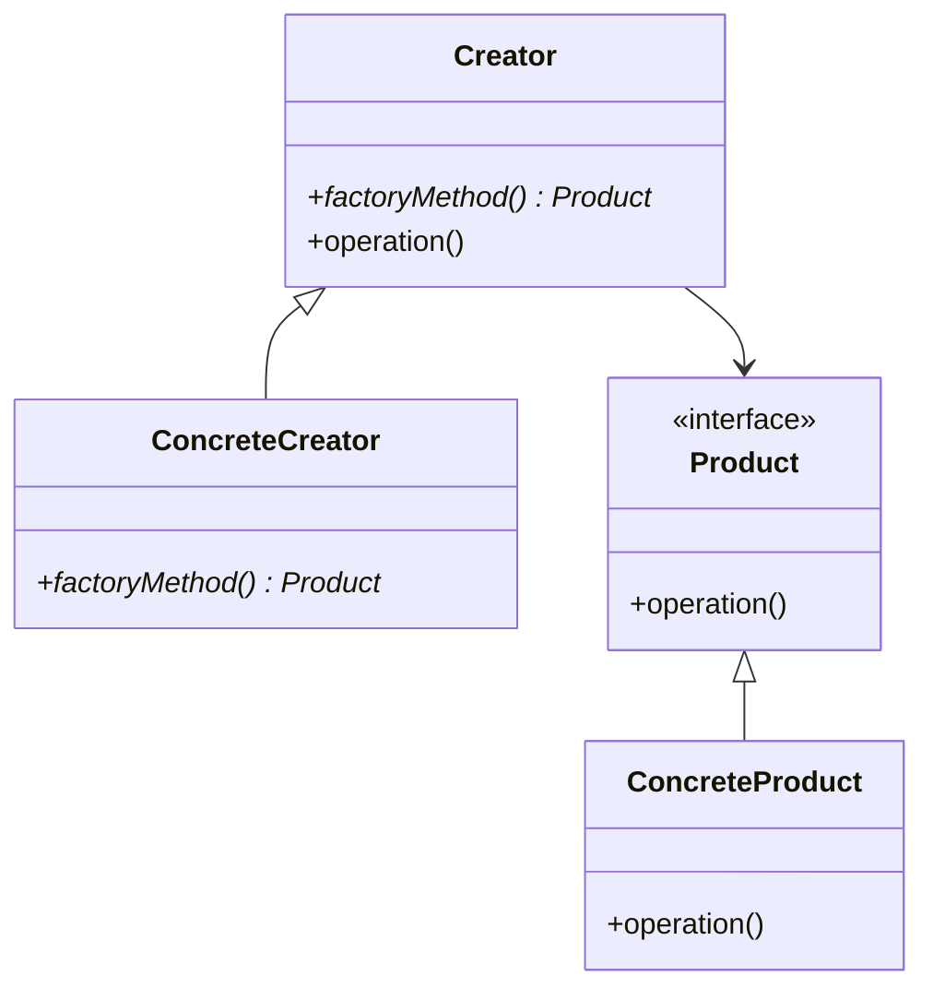
```mermaid
classDiagram
class Creator {
    +factoryMethod() Product*
    +operation()
}
class ConcreteCreator {
    +factoryMethod() Product*
}
class Product {
    <<interface>>
    +operation()
}
class ConcreteProduct {
    +operation()
}

Creator <|-- ConcreteCreator
Product <|-- ConcreteProduct
Creator --> Product
```

**C++示例**：
```cpp
class Product {
public:
    virtual void operation() = 0;
};

class ConcreteProduct : public Product {
public:
    void operation() override { /* 具体实现 */ }
};

class Creator {
public:
    virtual Product* factoryMethod() = 0;
    void operation() { 
        Product* p = factoryMethod();
        p->operation();
    }
};

class ConcreteCreator : public Creator {
public:
    Product* factoryMethod() override { 
        return new ConcreteProduct(); 
    }
};
```

### 1.2 抽象工厂模式（Abstract Factory）
**用途**：创建相关对象家族
**关键词**：生产成系列对象
**核心思想**：封装具体工厂，保证产品兼容性
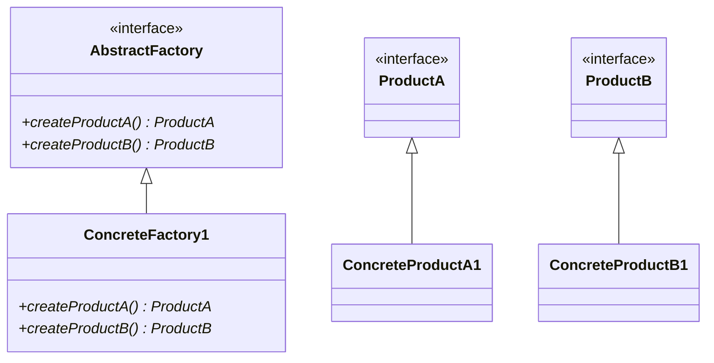
```mermaid
classDiagram
class AbstractFactory {
    <<interface>>
    +createProductA() ProductA*
    +createProductB() ProductB*
}
class ConcreteFactory1 {
    +createProductA() ProductA*
    +createProductB() ProductB*
}
class ProductA {
    <<interface>>
}
class ProductB {
    <<interface>>
}

AbstractFactory <|-- ConcreteFactory1
ProductA <|-- ConcreteProductA1
ProductB <|-- ConcreteProductB1
```

**C++示例**：
```cpp
class Button {
public:
    virtual void paint() = 0;
};

class WinButton : public Button {
public:
    void paint() override { /* Windows样式按钮 */ }
};

class MacButton : public Button {
public:
    void paint() override { /* Mac样式按钮 */ }
};

class GUIFactory {
public:
    virtual Button* createButton() = 0;
};

class WinFactory : public GUIFactory {
public:
    Button* createButton() override { return new WinButton(); }
};

class MacFactory : public GUIFactory {
public:
    Button* createButton() override { return new MacButton(); }
};
```


### 1.3 建造者模式（Builder）
**用途**：分步骤创建复杂对象
**关键词**：复杂对象构造
**核心思想**：分离构造与表示，支持不同配置  
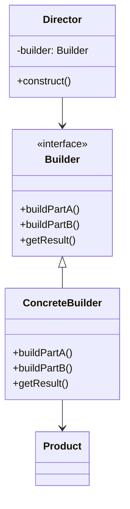
```mermaid
classDiagram
class Director {
    -builder: Builder
    +construct()
}
class Builder {
    <<interface>>
    +buildPartA()
    +buildPartB()
    +getResult()
}
class ConcreteBuilder {
    +buildPartA()
    +buildPartB()
    +getResult()
}
class Product

Director --> Builder
Builder <|-- ConcreteBuilder
ConcreteBuilder --> Product
```

**C++示例**：
```cpp
class Pizza {
public:
    void setDough(const string& dough) { /* ... */ }
    void setSauce(const string& sauce) { /* ... */ }
};

class PizzaBuilder {
public:
    virtual void buildDough() = 0;
    virtual void buildSauce() = 0;
    Pizza* getPizza() { return pizza; }
protected:
    Pizza* pizza = new Pizza();
};

class HawaiianBuilder : public PizzaBuilder {
public:
    void buildDough() override { pizza->setDough("cross"); }
    void buildSauce() override { pizza->setSauce("mild"); }
};

class Director {
    PizzaBuilder* builder;
public:
    void setBuilder(PizzaBuilder* b) { builder = b; }
    Pizza* construct() {
        builder->buildDough();
        builder->buildSauce();
        return builder->getPizza();
    }
};
```

### 1.4 原型模式（Prototype）
**用途**：通过复制现有对象创建新对象
**关键词**：克隆对象
**核心思想**：实现克隆接口，避免重复初始化  
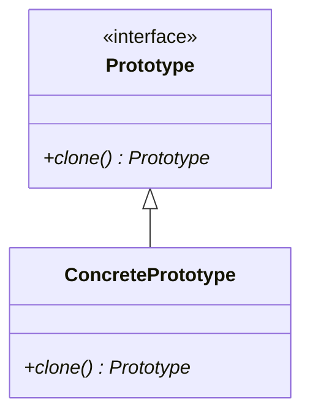
```mermaid
classDiagram
class Prototype {
    <<interface>>
    +clone() Prototype*
}
class ConcretePrototype {
    +clone() Prototype*
}

Prototype <|-- ConcretePrototype
```

**C++示例**：
```cpp
class Shape {
public:
    virtual Shape* clone() const = 0;
    virtual void draw() const = 0;
};

class Circle : public Shape {
    int radius;
public:
    Circle* clone() const override { return new Circle(*this); }
    void draw() const override { /* ... */ }
};
```

### 1.5 单例模式（Singleton）
**用途**：保证类只有一个实例
**关键词**：单实例
**核心思想**：私有化构造函数，静态访问点  
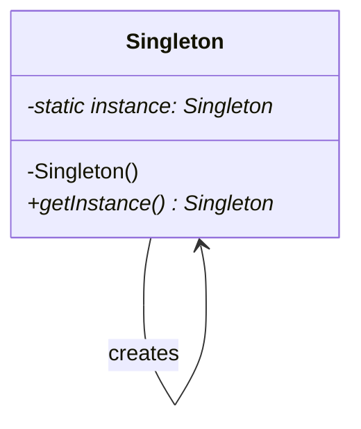
```mermaid
classDiagram
class Singleton {
    -static instance: Singleton*
    -Singleton()
    +getInstance() Singleton*
}

Singleton --> Singleton : creates
```

**C++示例**：
```cpp
class Logger {
    static Logger* instance;
    Logger() {} // 私有构造函数
public:
    static Logger* getInstance() {
        if (!instance) instance = new Logger();
        return instance;
    }
    void log(const string& msg) { /* ... */ }
};
Logger* Logger::instance = nullptr;
```

## 2. 结构型模式（7种）

主要关注类和对象的组合。结构型模式描述如何将类或对象按某种布局组成更大的结构。

### 2.1 适配器模式（Adapter）
**用途**：接口转换
**关键词**：转换接口
**核心思想**：包装不兼容接口成为可用接口
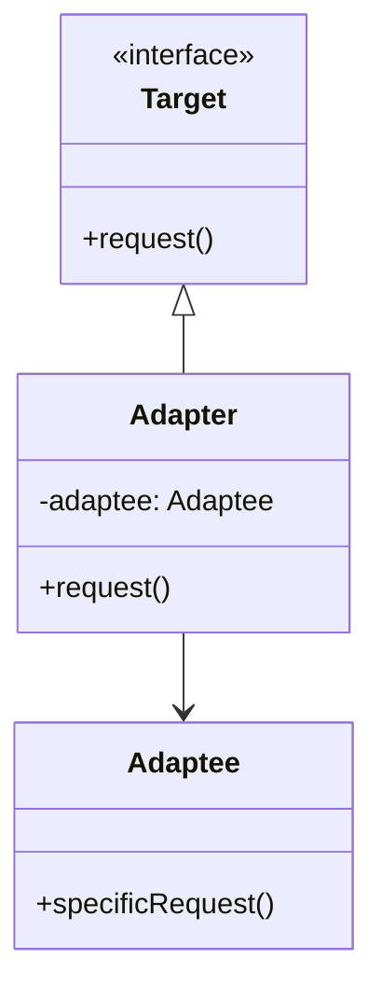
```mermaid
classDiagram
class Target {
    <<interface>>
    +request()
}
class Adaptee {
    +specificRequest()
}
class Adapter {
    -adaptee: Adaptee
    +request()
}

Target <|-- Adapter
Adapter --> Adaptee
```

**C++示例**：
```cpp
class EuropeanSocket {
public:
    virtual int voltage() { return 220; }
};

class USPlug {
public:
    virtual int voltage() = 0;
};

class Adapter : public USPlug {
    EuropeanSocket* socket;
public:
    Adapter(EuropeanSocket* s) : socket(s) {}
    int voltage() override { return socket->voltage() / 2; }
};
```

### 2.2 桥接模式（Bridge）
**用途**：分离抽象与实现
**关键词**：继承树拆分
**核心思想**：使用组合代替继承层次  
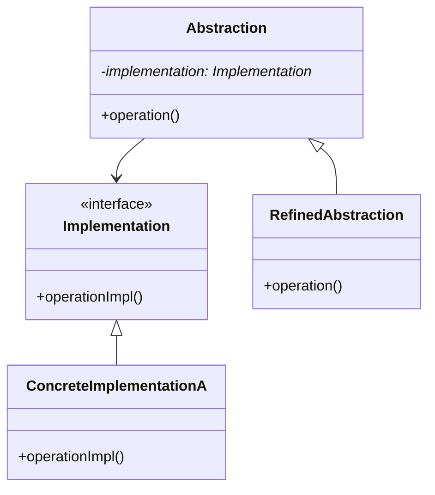
```mermaid
classDiagram
class Abstraction {
    -implementation: Implementation*
    +operation()
}
class Implementation {
    <<interface>>
    +operationImpl()
}
class RefinedAbstraction {
    +operation()
}
class ConcreteImplementationA {
    +operationImpl()
}

Abstraction <|-- RefinedAbstraction
Abstraction --> Implementation
Implementation <|-- ConcreteImplementationA
```

**C++示例**：
```cpp
class Device {
public:
    virtual void enable() = 0;
};

class Radio : public Device {
public:
    void enable() override { /* 打开收音机 */ }
};

class Remote {
protected:
    Device* device;
public:
    Remote(Device* d) : device(d) {}
    virtual void togglePower() {
        device->enable();
    }
};

class AdvancedRemote : public Remote {
public:
    AdvancedRemote(Device* d) : Remote(d) {}
    void mute() { /* 静音操作 */ }
};
```

### 2.3 组合模式（Composite）
**用途**：处理树形结构来表现“整体/部分”层次结构
**关键词**：树形目录结构
**核心思想**：统一对待简单和复杂元素  
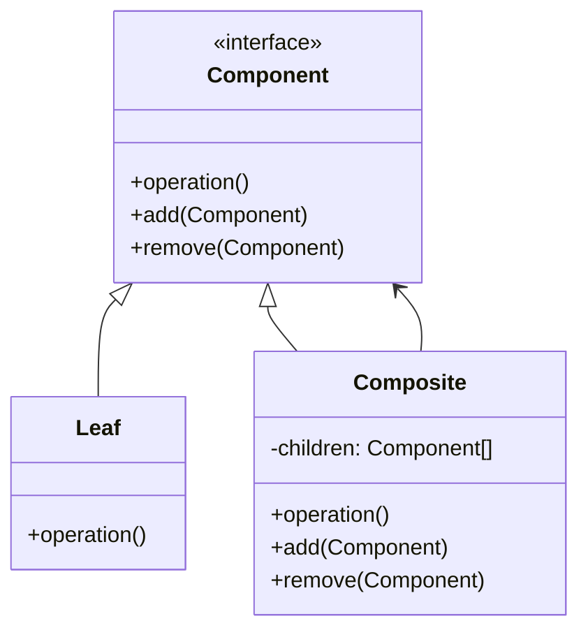
```mermaid
classDiagram
class Component {
    <<interface>>
    +operation()
    +add(Component)
    +remove(Component)
}
class Leaf {
    +operation()
}
class Composite {
    -children: Component[]
    +operation()
    +add(Component)
    +remove(Component)
}

Component <|-- Leaf
Component <|-- Composite
Composite --> Component
```

**C++示例**：
```cpp
class FileSystemComponent {
public:
    virtual void display(int indent) const = 0;
};

class File : public FileSystemComponent {
    string name;
public:
    void display(int indent) const override { /* 显示文件 */ }
};

class Directory : public FileSystemComponent {
    vector<FileSystemComponent*> children;
public:
    void add(FileSystemComponent* item) { children.push_back(item); }
    void display(int indent) const override {
        /* 显示目录并遍历子元素 */
    }
};
```

### 2.4 装饰器模式（Decorator）
**用途**：不改变现有对象的情况下动态添加职责，代替子类扩展，但是比子类灵活
**关键词**：动态附加职责
**核心思想**：通过组合实现功能叠加
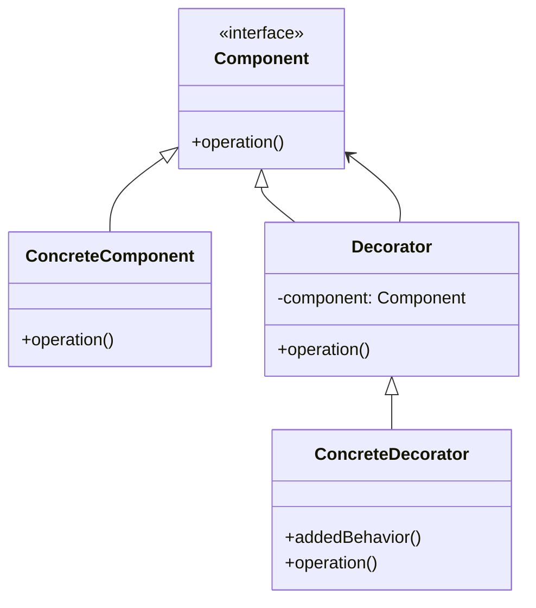
```mermaid
classDiagram
class Component {
    <<interface>>
    +operation()
}
class ConcreteComponent {
    +operation()
}
class Decorator {
    -component: Component
    +operation()
}
class ConcreteDecorator {
    +addedBehavior()
    +operation()
}

Component <|-- ConcreteComponent
Component <|-- Decorator
Decorator <|-- ConcreteDecorator
Decorator --> Component
```

**C++示例**：
```cpp
class Coffee {
public:
    virtual double cost() = 0;
};

class SimpleCoffee : public Coffee {
public:
    double cost() override { return 2.0; }
};

class CoffeeDecorator : public Coffee {
protected:
    Coffee* coffee;
public:
    CoffeeDecorator(Coffee* c) : coffee(c) {}
};

class MilkDecorator : public CoffeeDecorator {
public:
    MilkDecorator(Coffee* c) : CoffeeDecorator(c) {}
    double cost() override { return coffee->cost() + 0.5; }
};
```

### 2.5 外观模式（Facade）
**用途**：简化复杂子系统访问，用统一的接口来访问子系统中的一群接口
**关键词**：对外统一接口
**核心思想**：提供统一高层接口  
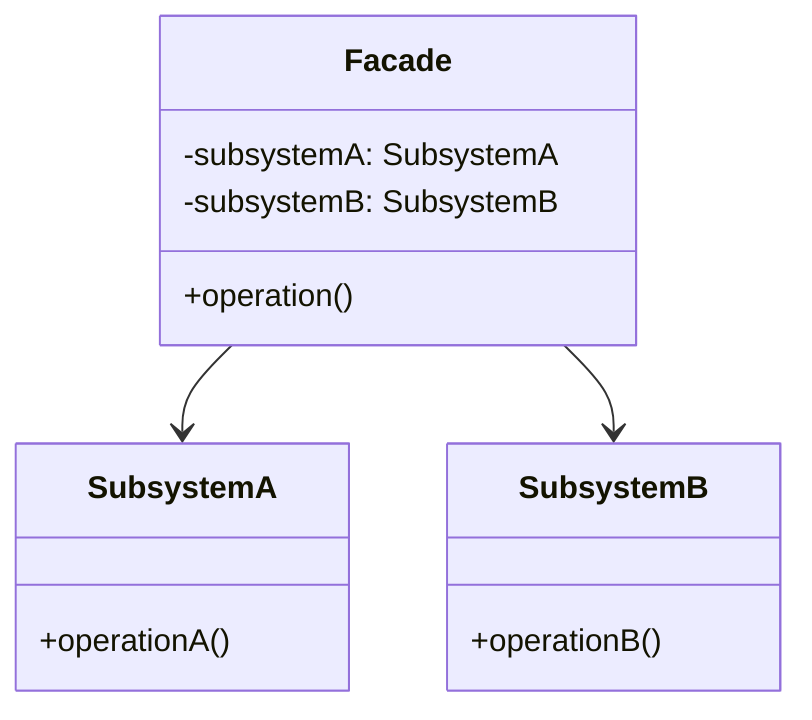
```mermaid
classDiagram
class Facade {
    -subsystemA: SubsystemA
    -subsystemB: SubsystemB
    +operation()
}
class SubsystemA {
    +operationA()
}
class SubsystemB {
    +operationB()
}

Facade --> SubsystemA
Facade --> SubsystemB
```

**C++示例**：
```cpp
class CPU {
public:
    void start() { /* 启动CPU */ }
};

class Memory {
public:
    void load() { /* 加载内存 */ }
};

class ComputerFacade {
    CPU cpu;
    Memory memory;
public:
    void start() {
        cpu.start();
        memory.load();
    }
};
```

### 2.6 享元模式（Flyweight）
**用途**：高效共享细粒度对象
**关键词**：汉字编程 
**核心思想**：分离内在状态与外在状态  
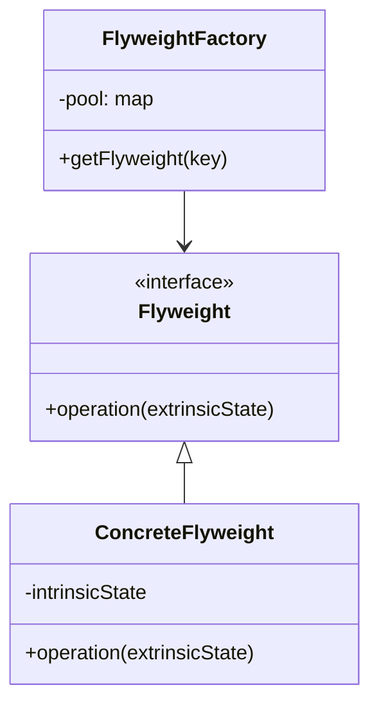
```mermaid
classDiagram
class FlyweightFactory {
    -pool: map<string,Flyweight*>
    +getFlyweight(key)
}
class Flyweight {
    <<interface>>
    +operation(extrinsicState)
}
class ConcreteFlyweight {
    -intrinsicState
    +operation(extrinsicState)
}

FlyweightFactory --> Flyweight
Flyweight <|-- ConcreteFlyweight
```

**C++示例**：
```cpp
class TreeType {
    string name;
    // 共享的固有属性
public:
    TreeType(const string& n) : name(n) {}
    void draw(int x, int y) { /* 绘制树木 */ }
};

class TreeFactory {
    static unordered_map<string, TreeType*> pool;
public:
    static TreeType* getType(const string& name) {
        if (!pool.count(name))
            pool[name] = new TreeType(name);
        return pool[name];
    }
};
```

### 2.7 代理模式（Proxy）
**用途**：控制对象访问
**关键词**：快捷方式
**核心思想**：提供替代对象进行访问控制  
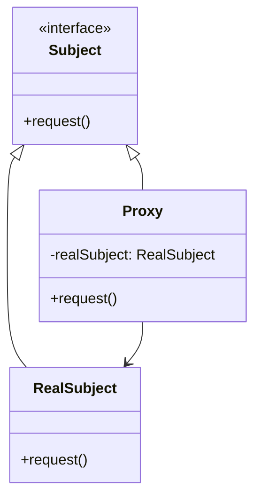
```mermaid
classDiagram
class Subject {
    <<interface>>
    +request()
}
class RealSubject {
    +request()
}
class Proxy {
    -realSubject: RealSubject
    +request()
}

Subject <|-- RealSubject
Subject <|-- Proxy
Proxy --> RealSubject
```

**C++示例**：
```cpp
class Image {
public:
    virtual void display() = 0;
};

class RealImage : public Image {
    string filename;
public:
    RealImage(const string& f) : filename(f) { loadFromDisk(); }
    void display() override { /* 显示图片 */ }
    void loadFromDisk() { /* 加载操作 */ }
};

class ProxyImage : public Image {
    RealImage* realImage;
    string filename;
public:
    ProxyImage(const string& f) : filename(f) {}
    void display() override {
        if (!realImage) realImage = new RealImage(filename);
        realImage->display();
    }
};
```

## 3. 行为型模式（11种）

主要关注对象之间的通信。行为型模式描述了类和对象如何交互，以及他们的行为是怎样的。

### 3.1 责任链模式（Chain of Responsibility）
**用途**：请求的链式处理。这种模式为请求创建了一个接收者对象的链，每个接收者都包含对另一个接收者的引用。如果一个对象不能处理该请求，它会把相同的请求传给下一个接收者，依此类推。它适用于需要在多个对象之间松散耦合的场景，并且希望在不明确指定接收者的情况下，向多个对象中的一个提交一个请求的场景。
**关键词**：传递职责
**核心思想**：解耦发送者与接收者，动态组合处理链  
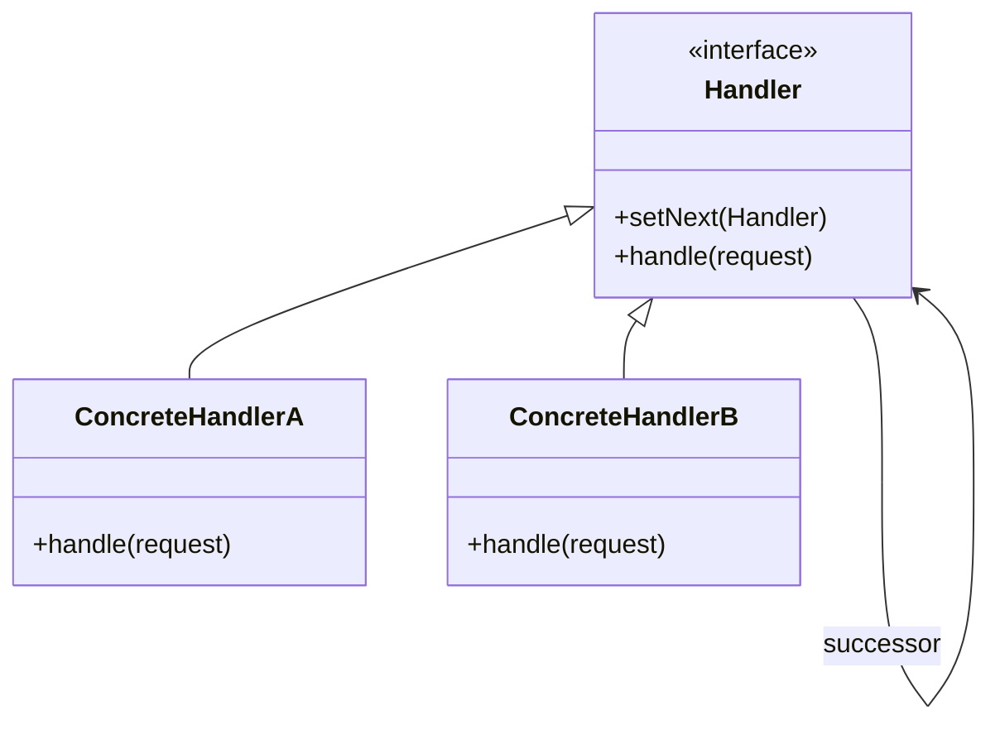
```mermaid
classDiagram
class Handler {
    <<interface>>
    +setNext(Handler)
    +handle(request)
}
class ConcreteHandlerA {
    +handle(request)
}
class ConcreteHandlerB {
    +handle(request)
}

Handler <|-- ConcreteHandlerA
Handler <|-- ConcreteHandlerB
Handler --> Handler : successor
```

**C++示例**：
```cpp
class Handler {
protected:
    Handler* next;
public:
    virtual void handle(int req) = 0;
    void setNext(Handler* h) { next = h; }
};

class Level1Support : public Handler {
public:
    void handle(int req) override {
        if (req <= 5) { /* 处理请求 */ }
        else if (next) next->handle(req);
    }
};

class Level2Support : public Handler {
public:
    void handle(int req) override {
        if (req > 5 && req <= 10) { /* 处理请求 */ }
        else if (next) next->handle(req);
    }
};
```

### 3.2 命令模式（Command）
**用途**：将请求封装为对象。以便使用不同的请求、队列或日志来参数化其他对象。它适用于需要支持命令的撤销和恢复、延迟调用或日志操作的场景。
**关键词**：日志记录，可撤销
**核心思想**：分离调用者与执行者  
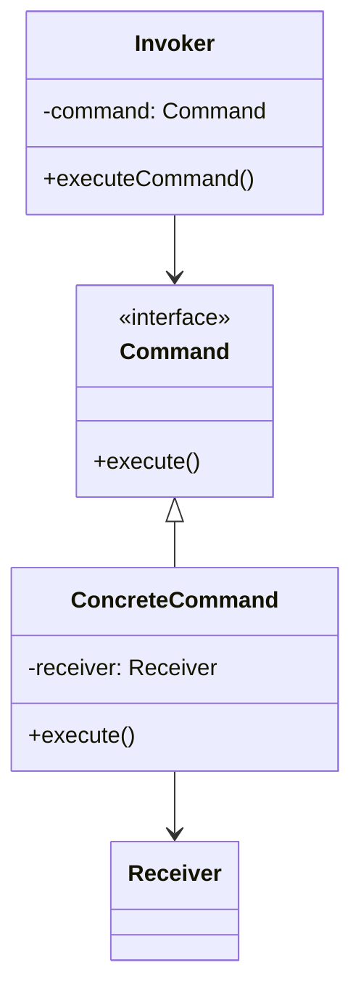
```mermaid
classDiagram
class Invoker {
    -command: Command
    +executeCommand()
}
class Command {
    <<interface>>
    +execute()
}
class ConcreteCommand {
    -receiver: Receiver
    +execute()
}
class Receiver

Invoker --> Command
Command <|-- ConcreteCommand
ConcreteCommand --> Receiver
```

**C++示例**：
```cpp
class Light {
public:
    void on() { /* 开灯 */ }
};

class Command {
public:
    virtual void execute() = 0;
};

class LightOnCommand : public Command {
    Light* light;
public:
    void execute() override { light->on(); }
};

class RemoteControl {
    Command* slot;
public:
    void setCommand(Command* cmd) { slot = cmd; }
    void pressButton() { slot->execute(); }
};
```

### 3.3 迭代器模式（Iterator）
**用途**：统一集合遍历方式
**关键词**：数据集
**核心思想**：封装集合的内部结构  
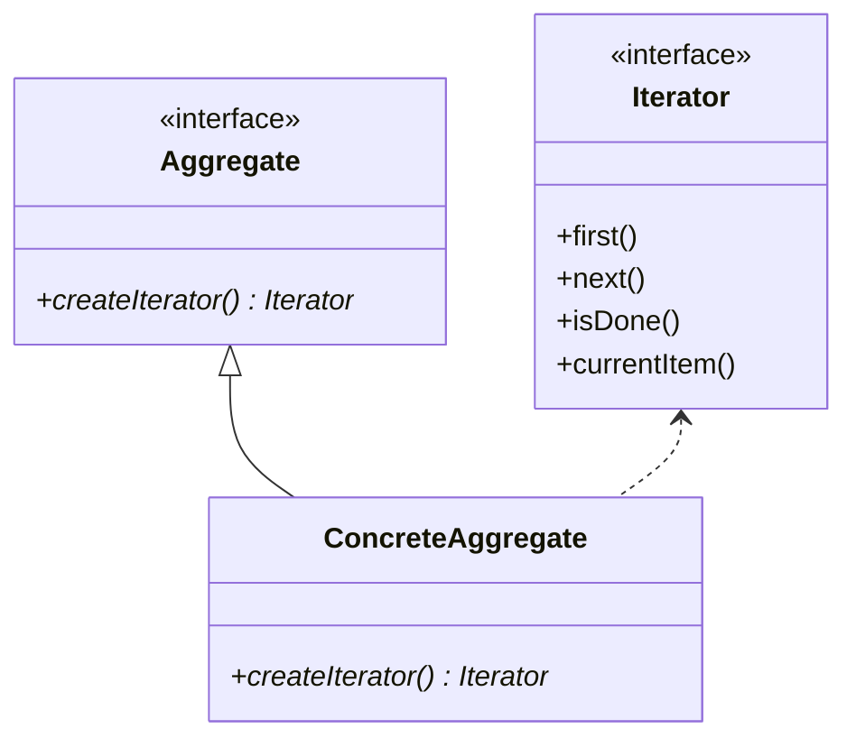
```mermaid
classDiagram
class Aggregate {
    <<interface>>
    +createIterator() Iterator*
}
class ConcreteAggregate {
    +createIterator() Iterator*
}
class Iterator {
    <<interface>>
    +first()
    +next()
    +isDone()
    +currentItem()
}

Aggregate <|-- ConcreteAggregate
Iterator <.. ConcreteAggregate
```

**C++示例**：
```cpp
template <typename T>
class Iterator {
public:
    virtual T first() = 0;
    virtual T next() = 0;
    virtual bool isDone() = 0;
};

class NumberIterator : public Iterator<int> {
    vector<int> data;
    int index = 0;
public:
    int first() override { return data[0]; }
    int next() override { return data[++index]; }
    bool isDone() override { return index >= data.size(); }
};
```

### 3.4 中介者模式（Mediator）
**用途**：减少对象间直接耦合。用一个中介对象来封装一系列的对象交互，使各对象不需要显式地相互引用，从而使耦合松散，而且可以独立地改变它们之间的交互。
**关键词**：不直接引用
**核心思想**：通过中介对象协调交互  
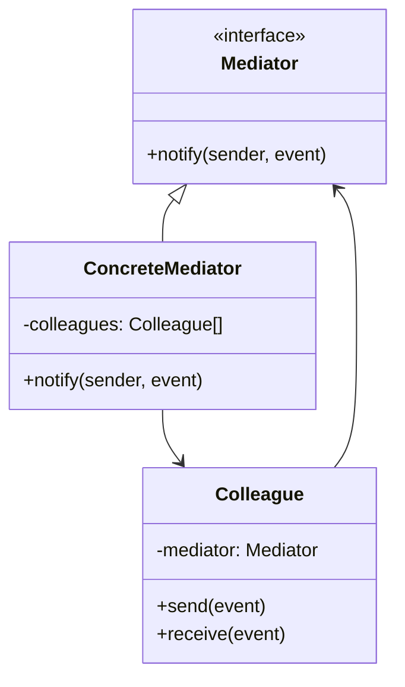
```mermaid
classDiagram
class Mediator {
    <<interface>>
    +notify(sender, event)
}
class ConcreteMediator {
    -colleagues: Colleague[]
    +notify(sender, event)
}
class Colleague {
    -mediator: Mediator
    +send(event)
    +receive(event)
}

Mediator <|-- ConcreteMediator
Colleague --> Mediator
ConcreteMediator --> Colleague
```

**C++示例**：
```cpp
class ChatRoom; // Mediator
class User {
    ChatRoom* room;
public:
    void send(const string& msg);
};

class ChatRoom {
    vector<User*> users;
public:
    void broadcast(User* sender, const string& msg) {
        for (auto u : users)
            if (u != sender) u->receive(msg);
    }
};
```

### 3.5 备忘录模式（Memento）
**用途**：对象状态快照管理。这种模式提供了一种方法来在不破坏封装性的情况下获取一个对象的内部状态，并在需要的时候将对象恢复到先前的状态。
**关键词**：游戏存档
**核心思想**：分离状态保存与恢复逻辑  
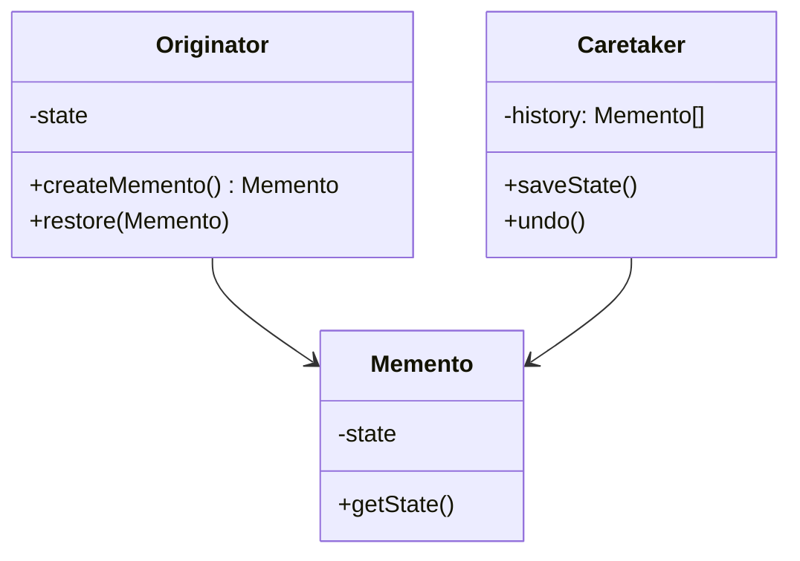
```mermaid
classDiagram
class Originator {
    -state
    +createMemento() Memento
    +restore(Memento)
}
class Memento {
    -state
    +getState()
}
class Caretaker {
    -history: Memento[]
    +saveState()
    +undo()
}

Originator --> Memento
Caretaker --> Memento
```

**C++示例**：
```cpp
class EditorMemento {
    string content;
public:
    EditorMemento(const string& s) : content(s) {}
    string getContent() { return content; }
};

class TextEditor {
    string content;
public:
    EditorMemento* save() { return new EditorMemento(content); }
    void restore(EditorMemento* m) { content = m->getContent(); }
};
```

### 3.6 观察者模式（Observer）
**用途**：实现发布-订阅机制
**关键词**：联动，微信公众号
**核心思想**：定义一对多的依赖关系
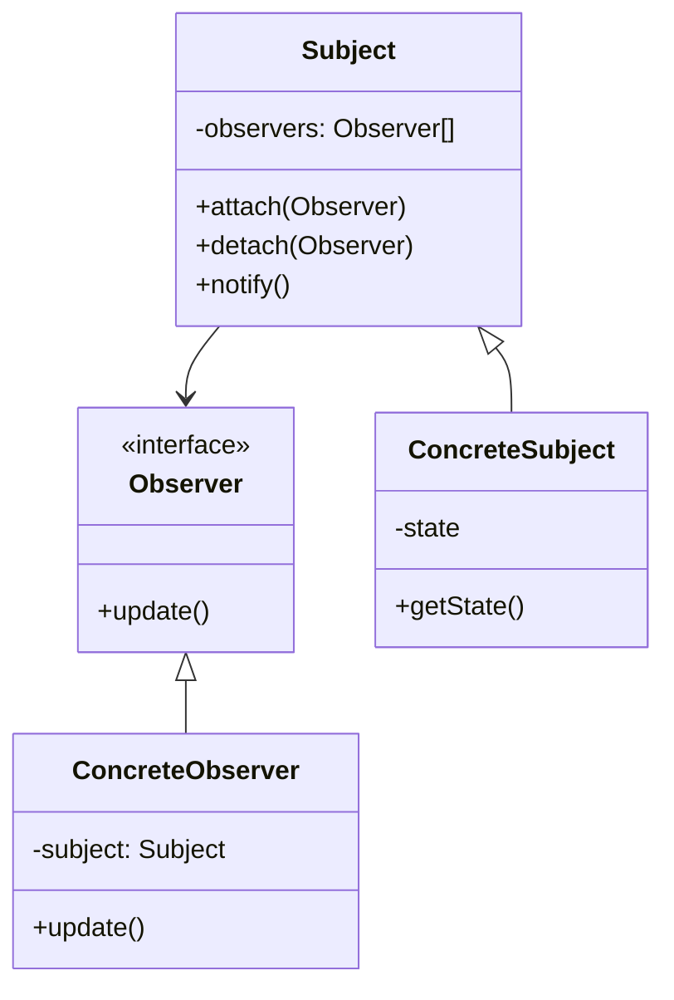
```mermaid
classDiagram
class Subject {
    -observers: Observer[]
    +attach(Observer)
    +detach(Observer)
    +notify()
}
class Observer {
    <<interface>>
    +update()
}
class ConcreteSubject {
    -state
    +getState()
}
class ConcreteObserver {
    -subject: Subject
    +update()
}

Subject <|-- ConcreteSubject
Observer <|-- ConcreteObserver
Subject --> Observer
```

**C++示例**：
```cpp
class Observer {
public:
    virtual void update() = 0;
};

class Subject {
    vector<Observer*> observers;
public:
    void attach(Observer* o) { observers.push_back(o); }
    void notify() { for(auto o : observers) o->update(); }
};

class TemperatureSensor : public Subject {
    float temp;
public:
    void setTemp(float t) { 
        temp = t;
        notify();
    }
};

class Display : public Observer {
    TemperatureSensor* sensor;
public:
    Display(TemperatureSensor* s) : sensor(s) {}
    void update() override { 
        cout << "温度变化：" << sensor->getTemp();
    }
};
```

### 3.7 状态模式（State）
**用途**：对象状态驱动行为变化
**关键词**：状态变成类
**核心思想**：封装状态相关行为到独立类  
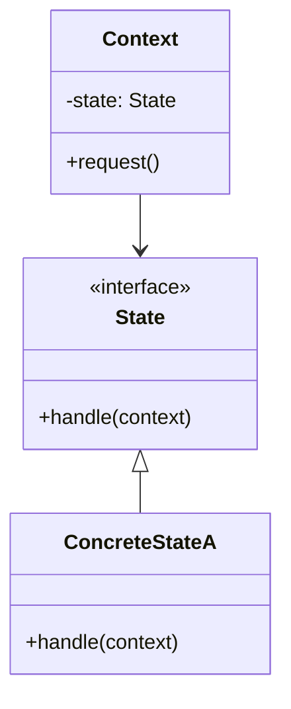
```mermaid
classDiagram
class Context {
    -state: State
    +request()
}
class State {
    <<interface>>
    +handle(context)
}
class ConcreteStateA {
    +handle(context)
}

Context --> State
State <|-- ConcreteStateA
```

**C++示例**：
```cpp
class VendingMachine; // Context
class State {
public:
    virtual void insertCoin(VendingMachine* vm) = 0;
    virtual void selectItem(VendingMachine* vm) = 0;
};

class NoCoinState : public State {
public:
    void insertCoin(VendingMachine* vm) override;
};
```

### 3.8 策略模式（Strategy）
**用途**：算法互换
**关键词**：多方案切换
**核心思想**：封装算法族，独立变化
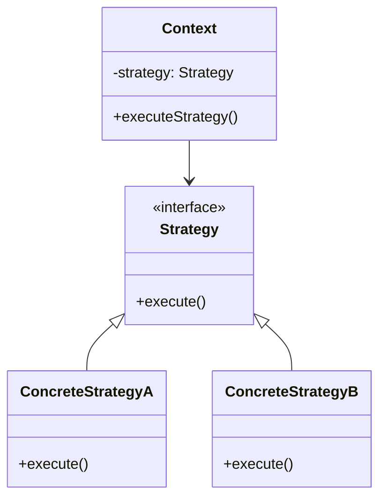
```mermaid
classDiagram
class Context {
    -strategy: Strategy
    +executeStrategy()
}
class Strategy {
    <<interface>>
    +execute()
}
class ConcreteStrategyA {
    +execute()
}
class ConcreteStrategyB {
    +execute()
}

Context --> Strategy
Strategy <|-- ConcreteStrategyA
Strategy <|-- ConcreteStrategyB
```

**C++示例**：
```cpp
class SortStrategy {
public:
    virtual void sort(vector<int>& data) = 0;
};

class QuickSort : public SortStrategy {
public:
    void sort(vector<int>& data) override { /* 快速排序实现 */ }
};

class Context {
    SortStrategy* strategy;
public:
    void setStrategy(SortStrategy* s) { strategy = s; }
    void execute(vector<int>& data) { strategy->sort(data); }
};
```

### 3.9 模板方法模式（Template Method）
**用途**：定义算法骨架
**关键词**：框架 
**核心思想**：固定步骤顺序，允许子类重写特定步骤  
```mermaid
classDiagram
class AbstractClass {
    +templateMethod()
    +primitiveOperation1()
    +primitiveOperation2()
}
class ConcreteClass {
    +primitiveOperation1()
    +primitiveOperation2()
}

AbstractClass <|-- ConcreteClass
```

**C++示例**：
```cpp
class DataExporter {
public:
    void exportData() {
        formatData();
        compressData();
        transfer();
    }
protected:
    virtual void formatData() = 0;
    void compressData() { /* 默认压缩实现 */ }
    void transfer() { /* 传输实现 */ }
};

class CSVExporter : public DataExporter {
protected:
    void formatData() override { /* CSV格式化 */ }
};
```

### 3.10 访问者模式（Visitor）
**用途**：在不修改类结构的情况下添加操作
**关键词**：数据与操作分离
**核心思想**：双重分发技术  
```mermaid
classDiagram
class Visitor {
    <<interface>>
    +visitA(ElementA)
    +visitB(ElementB)
}
class Element {
    <<interface>>
    +accept(Visitor)
}
class ElementA {
    +accept(Visitor)
}
class VisitorImpl {
    +visitA(ElementA)
    +visitB(ElementB)
}

Visitor <|-- VisitorImpl
Element <|-- ElementA
Element --> Visitor
```

**C++示例**：
```cpp
class DocumentVisitor;
class DocumentElement {
public:
    virtual void accept(DocumentVisitor&) = 0;
};

class TextNode : public DocumentElement {
public:
    void accept(DocumentVisitor& v) override;
};

class DocumentVisitor {
public:
    virtual void visit(TextNode&) = 0;
};
```

### 3.11 解释器模式（Interpreter）
**用途**：定义语法规则的解释器
**关键词**：虚拟机的机制
**核心思想**：构建语法树进行表达式求值  
```mermaid
classDiagram
class Expression {
    <<interface>>
    +interpret(context)
}
class TerminalExpression {
    +interpret(context)
}
class NonterminalExpression {
    -expression: Expression
    +interpret(context)
}

Expression <|-- TerminalExpression
Expression <|-- NonterminalExpression
NonterminalExpression --> Expression
```

**C++示例**：
```cpp
class Expression {
public:
    virtual bool interpret(const string& context) = 0;
};

class TerminalExpression : public Expression {
    string data;
public:
    bool interpret(const string& context) override {
        return context.find(data) != string::npos;
    }
};
```