### 1. **类图 (Class Diagram)**
• **类型**: 结构图
• **功能**: 显示系统静态结构，描述类、接口、协作及其关系
• **用途**: 面向对象系统建模、数据库设计
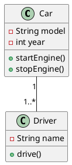

---

### 2. **对象图 (Object Diagram)**
• **类型**: 结构图
• **功能**: 展示某一时刻对象的实例及关系
• **用途**: 调试复杂类关系、验证系统状态
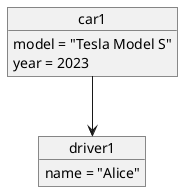

---

### 3. **组件图 (Component Diagram)**
• **类型**: 结构图
• **功能**: 描述系统组件及其依赖关系
• **用途**: 模块化设计、系统架构规划
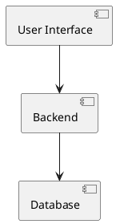

---

### 4. **部署图 (Deployment Diagram)**
• **类型**: 结构图
• **功能**: 展示物理节点和软件部署关系
• **用途**: 分布式系统架构设计
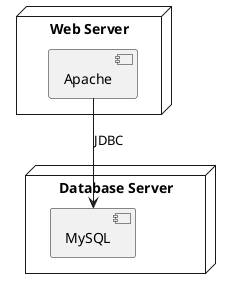

---

### 5. **包图 (Package Diagram)**
• **类型**: 结构图
• **功能**: 组织模型元素到逻辑组
• **用途**: 代码分层、模块化设计
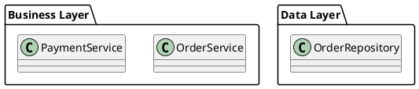

---

### 6. **复合结构图 (Composite Structure Diagram)**
• **类型**: 结构图
• **功能**: 展示类的内部结构（部件和连接器）
• **用途**: 复杂组件内部设计
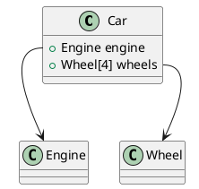

---

### 7. **轮廓图 (Profile Diagram)**
• **类型**: 结构图
• **功能**: 通过构造型（Stereotypes）扩展UML元模型
• **用途**: 领域特定建模（DSM）
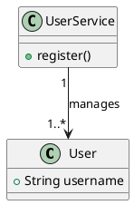

---

### 8. **用例图 (Use Case Diagram)**
• **类型**: 行为图
• **功能**: 描述系统功能需求与参与者交互
• **用途**: 需求分析、功能规划
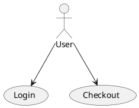

---

### 9. **活动图 (Activity Diagram)**
• **类型**: 行为图
• **功能**: 描述业务流程或算法流程
• **用途**: 工作流建模、复杂逻辑可视化
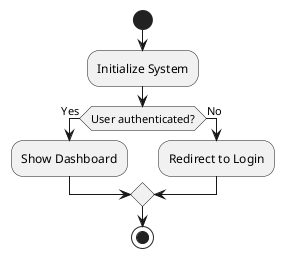

---

### 10. **状态机图 (State Machine Diagram)**
• **类型**: 行为图
• **功能**: 展示对象状态变化
• **用途**: 实时系统建模、设备控制逻辑
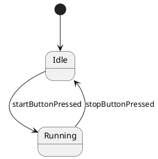

---

### 11. **序列图 (Sequence Diagram)**
• **类型**: 交互图
• **功能**: 按时间顺序显示对象间消息传递
• **用途**: 业务流程验证、接口设计
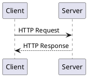

---

### 12. **通信图 (Communication Diagram)**
• **类型**: 交互图
• **功能**: 强调对象间结构关系与消息传递
• **用途**: 对象协作分析
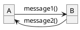

---

### 13. **时序图 (Timing Diagram)**
• **类型**: 交互图
• **功能**: 展示状态变化与时间约束
• **用途**: 实时系统时序分析

下面我们以用户注册为例，绘制一个基础的时序图，并依次讲解每一个元素的具体含义。在注册链路中，首先用户在浏览器上填写注册表单，点击发送按钮，会调用后端的注册服务去创建注册信息，在注册服务中，会调用账号服务创建对应的账号信息，以及绑定一些关联关系，创建成功后，调用登录服务去生成对应的登录token，下发登录态，最后发送相关的注册消息给下游。整体的时序图代码如下所示：

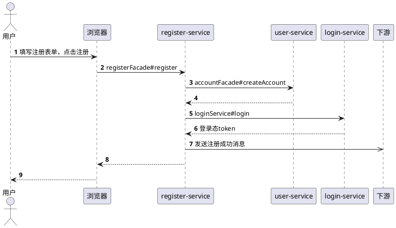

---

### 14. **交互概览图 (Interaction Overview Diagram)**
• **类型**: 交互图
• **功能**: 组合多个交互图展示整体流程
• **用途**: 复杂交互流程概览
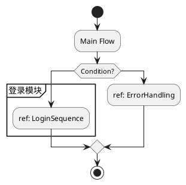

---

**说明**：
1. 安装PlantUML插件后可直接渲染代码生成图表
2. 部分图表（如轮廓图）可能需要特定PlantUML扩展支持
3. 实际使用时可根据需求添加更多细节元素（颜色、注释等）