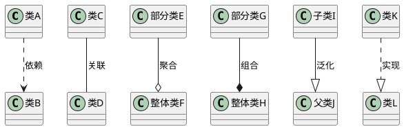

## 规则

- 定义：规定构造块如何放在一起
- 构造块命名
- 范围：给一个名字以特定含义的语境
- 可见性：如何使用或看见名字
- 完整性：事物如何正确、一致的相互联系
- 执行：运行或模拟动态模型的含义是什么

## 公共机制

- 规格说明：语义的细节描述，模型的真正核心
- 修饰：可以表达更多的信息
- 扩展机制
  - 约束
  - 构造型
  - 标记值

## 构造块

### 事务

- 结构：静态部分，包括类、接口、协作、用例、活动类、构件、节点
- 行为：动态部分，包括消息、动作次序、连接
- 分组：组织部分，包括包、构件
- 注释：解释部分

### 关系

- 类关系
  - 依赖：依赖是两个事物间的语义关系，其中一个事物发生变化会影响另一个事物的语义
  - 关联：描述一组对象之间连接的结构关系
    - 聚合关系：整体与部分生命周期不同
    - 组合关系：整体与部分生命周期相同
  - 泛化：一般与特殊的关系
  - 实现：类实现接口，接口指定了由实现类保证执行的契约
- 用例关系
  - 包含：A用例必须包含B用例，则A包含B
  - 扩展：A用例有时会使用B用例，则A是基本用例，B是扩展用例
  - 泛化：特殊与一般的关系

### 图

#### 结构图/静态图

##### 1. **类图 (Class Diagram)**
• **功能**: 显示系统静态结构，描述一组类、接口、协作及其关系
• **用途**: 面向对象系统建模、数据库设计
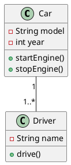

---

##### 2. **对象图 (Object Diagram)**
• **功能**: 展示某一时刻对象的实例及关系
• **用途**: 调试复杂类关系、验证系统状态
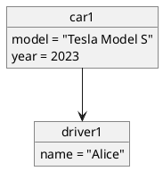

类与对象

---

##### 3. **构件/组件图 (Component Diagram)**
• **功能**: 描述一个封装的类和他的接口、端口以及构件与连接件的架构图
• **用途**: 模块化设计、系统架构规划
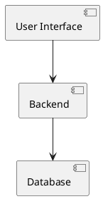

---

##### 4. **部署图 (Deployment Diagram)**
• **功能**: 展示物理节点和软件部署关系
• **用途**: 分布式系统架构设计
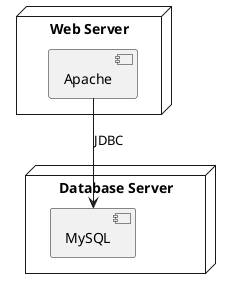

---

##### 5. **包图 (Package Diagram)**
• **功能**: 描述由模型本身分解而成的组织单元，及其之间的依赖关系
• **用途**: 代码分层、模块化设计
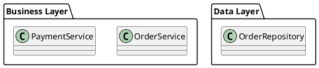

---

##### 6. **组合/复合结构图 (Composite Structure Diagram)**
• **功能**: 展示类的内部结构（部件和连接器）
• **用途**: 复杂组件内部设计
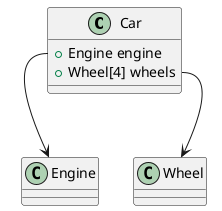

---

##### 7. **制品图**
• **功能**: 描述计算机中一个系统的物理结构，制品包括文件、数据库等。
• **用途**: 

---

#### 动态图/行为图

##### 8. **用例图 (Use Case Diagram)**
• **功能**: 描述一组用例】参与者及它们之间的关系，展示外部参与者与系统的交互
• **用途**: 需求分析、功能规划
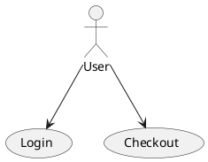

---

##### 9. **活动图 (Activity Diagram)**
• **功能**: 类似于流程图，强调交互行为，能表并发，描述业务流程或算法流程
• **用途**: 工作流建模、复杂逻辑可视化
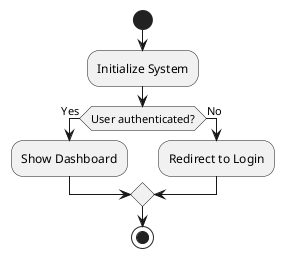

并发分叉、并发汇合、监护表达式、分支、流

---

##### 10. **状态图 (State Machine Diagram)**
• **功能**: 由状态、转移、事件和活动组成，展示对象状态变化
• **用途**: 实时系统建模、设备控制逻辑
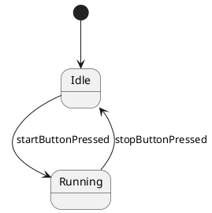

---

##### 交互图

###### 11. **顺序/序列图 (Sequence Diagram)**
• **功能**: 按**时间顺序**显示对象间消息传递
• **用途**: 业务流程验证、接口设计
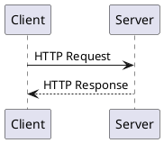

---

###### 12. **通信图 (Communication Diagram)**
• **功能**: 强调对象间结构关系与消息传递
• **用途**: 对象协作分析
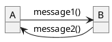

---

###### 13. **定时/时序图 (Timing Diagram)**
• **功能**: 展示状态变化与**时间**约束
• **用途**: 实时系统时序分析

下面我们以用户注册为例，绘制一个基础的时序图，并依次讲解每一个元素的具体含义。在注册链路中，首先用户在浏览器上填写注册表单，点击发送按钮，会调用后端的注册服务去创建注册信息，在注册服务中，会调用账号服务创建对应的账号信息，以及绑定一些关联关系，创建成功后，调用登录服务去生成对应的登录token，下发登录态，最后发送相关的注册消息给下游。整体的时序图代码如下所示：

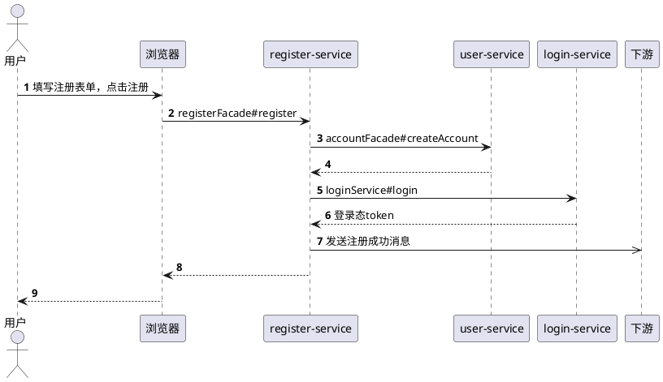

---

###### 14. **交互概览图 (Interaction Overview Diagram)**
• **功能**: 组合多个交互图展示整体流程
• **用途**: 复杂交互流程概览
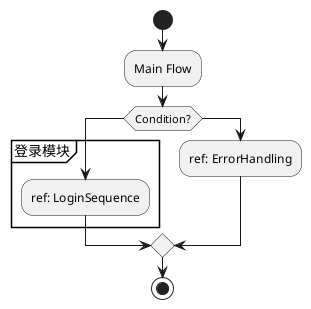